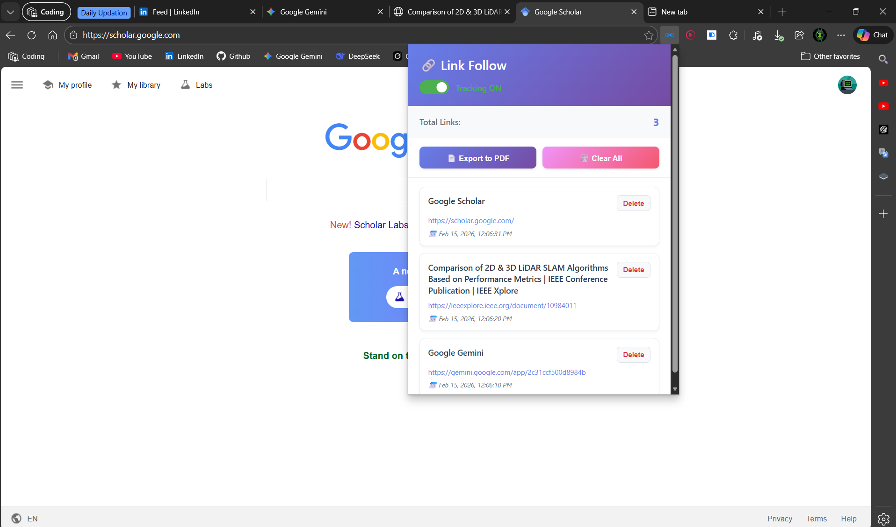

# 🔗 History Tracker

**A Privacy-First Browser Extension for Researchers & Data Organizers**



> **Track your research journey, organize your sources, and export professional reports—all locally.**

## 🚀 Overview

**History Tracker** (formerly *Link Follow*) solves the problem of "lost research tabs." It automatically logs every website you visit during a session, timestamps it, and stores it securely in your browser's local storage. When you're done, generate a clean **PDF Report** of your entire browsing history with one click.

Whether you're conducting a literature review, competitive analysis, or just want a personal log of your web activity, History Tracker keeps your data yours.

## ✨ Key Features

- **🛡️ 100% Private & Local**: No cloud servers, no tracking pixels. Your data never leaves your device.
- **⏱️ Automated Logging**: Captures URL and Page Title with precise timestamps as you browse.
- **📄 One-Click PDF Export**: Generate a beautifully formatted PDF report of your session (powered by `jsPDF`).
- **🎛️ Total Control**:
  - **Toggle**: Turn tracking ON/OFF instantly.
  - **Edit**: Delete individual links or clear your entire history.
- **📦 Lightweight**: Optimized for performance with minimal resource usage.

## 🛠️ Installation

1. **Clone or Download** this repository.
   ```bash
   git clone https://github.com/sanjai-web/History-Tracker-Extension.git
   ```
2. Open **Chrome** (or any Chromium browser like Edge/Brave) and navigate to:
   `chrome://extensions/`
3. Toggle **Developer mode** in the top right corner.
4. Click **Load unpacked**.
5. Select the folder where you saved this project.
6. Pin the extension icon for easy access!

## 📖 Usage Guide

1. **Start Tracking**: Click the extension icon and ensure the toggle is **ON**.
2. **Browse Normally**: Visit websites as you usually would. The extension works in the background.
3. **Review**: Open the popup to see your live history list.
4. **Export**: Click **"📄 Export to PDF"** to download your session report.
5. **Clean Up**: Use the trash icon to remove specific links or "Clear All" to reset.

## 🔒 Privacy Policy

We believe in privacy by design.
- **Storage**: All data is stored in `chrome.storage.local`.
- **Permissions**:
  - `tabs` & `webNavigation`: To detect page visits.
  - `storage`: To save your history locally.
- **No Analytics**: We do not collect usage data or personal information.

## 💻 Technologies Used

- **HTML5 & CSS3** (Custom responsive design)
- **JavaScript (ES6+)**
- **Chrome Extensions API (Manifest V3)**
- **jsPDF** (PDF generation library)

---

**Enjoy your organized research!** 📚✨
